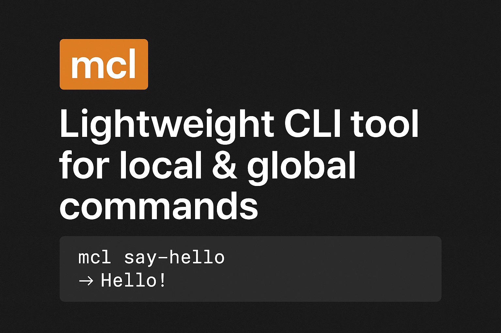
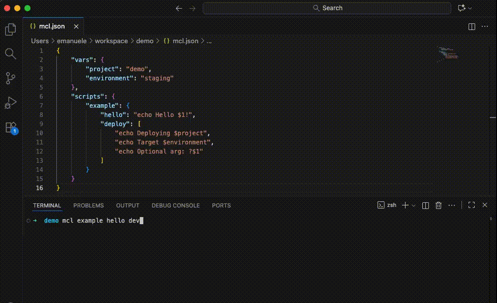
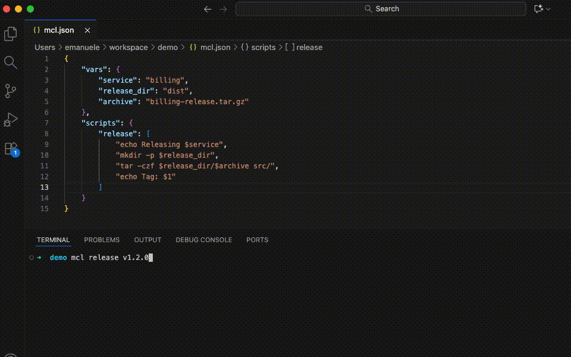

# ⚡ mcl-tool — My Command Line

> **Turn JSON recipes into powerful automation scripts**. Write once, run everywhere.

A lightweight, batteries-included CLI that makes command automation effortless. Compose reusable scripts with variables, nested flows, and safe execution—all stored in simple JSON.

[](https://pypi.org/project/mcl-tool/)
[](LICENSE)


<p align="center">
	
</p>

---

## ✨ Why mcl-tool?

| Feature                   | Description                                                                                                       |
| ------------------------- | ----------------------------------------------------------------------------------------------------------------- |
| 🎯 **Composable scripts** | Author commands once in JSON and call them from anywhere.                                                         |
| 🔄 **Args & vars**        | Mix positional placeholders (`$1`, `$2`) with config vars and optional fragments. Use `$$` to escape literal `$`. |
| 🎲 **Nested flows**       | Navigate nested script structures via space notation: `mcl example date utc`. Consistent display and execution. |
| 🛡️ **Safe execution**     | Dry-run mode, opt-in environment sharing, structured logging.                                                     |
| 📐 **Developer-friendly** | Strict type hints, comprehensive test coverage, mypy/black enforced in CI.                                                 |
| 🔓 **Open source**        | MIT-licensed; fork, adapt, and redistribute freely with attribution.                                              |

## Installation

### Recommended: pipx (macOS / Linux)

The easiest way to get started—[pipx](https://pipx.pypa.io/) manages isolation and PATH for you:

```bash
pipx install mcl-tool
```

### Alternative: virtual environment

If you prefer managing the venv yourself:

1. Ensure Python 3.8+ is available (`python3 --version`).
2. Create and activate an isolated environment:
   ```bash
   python3 -m venv ~/.venvs/mcl
   source ~/.venvs/mcl/bin/activate
   python -m pip install --upgrade pip
   ```
3. Install the CLI:
   ```bash
   pip install mcl-tool
   ```

## Quick Start

1. **Initialize a project config**
   ```bash
   mcl init
   ```
2. **Edit `mcl.json`** (local overrides global `~/.mcl/global-mcl.json`):
   ```json
   {
     "vars": {
       "project": "mcl",
       "version": "0.1.0"
     },
     "scripts": {
       "example": {
         "hello": "echo Hello, $1!",
         "deploy": ["echo Deploying $project", "?$1", "echo Version $version"],
         "date": {
           "show": "date",
           "utc": "date -u"
         }
       }
     }
   }
   ```
3. **Run commands**
   ```bash
   mcl                          # Shows interactive menu or list:
                                # • example hello
                                # • example deploy
                                # • example date show
                                # • example date utc
   
   mcl example hello Alice      # Execute with spaces
   mcl example deploy staging   # Optional arg substituted into '?$1'
   mcl example date utc         # Nested command
   mcl --dry-run example date utc  # Dry-run mode
   ```

## Demo

<p align="center">
	
</p>

<p align="center">
	
</p>

## Command Reference

| Command                      | Description                                                                   |
| ---------------------------- | ----------------------------------------------------------------------------- |
| `mcl init`                   | Create a stub `mcl.json` without overwriting existing files.                  |
| `mcl edit`                   | Open the global config (`~/.mcl/global-mcl.json`) in `$EDITOR`.               |
| `mcl run <script> [args...]` | Execute a script node; errors bubble as `ValueError` for clean Click aborts.  |
| `mcl <script> [args...]`     | Shorthand for `mcl run ...`, including nested paths (`mcl example date utc`). |
| `--dry-run`                  | Print rendered commands without executing.                                    |
| `--share-vars`               | Export config vars and args as env vars for shell-based scripts.              |

## Configuration Notes

- Scripts accept strings, ordered lists, or nested objects; comment lines starting with `#` are ignored.
- **Nested scripts notation**: Scripts are displayed AND executed with space-separated paths (e.g., `example hello`, `docker build`). Use spaces to invoke nested commands.
- Positional placeholders (`$1`, `$2`, …) map to CLI args; optional placeholders (`?$3`) drop when missing.
- **Escape syntax**: Use `$$` to output a literal `$` without substitution. For example, `$$1` becomes `$1` in the output (useful when generating shell scripts that use their own parameters).
- Config vars become substitutions (`$project`) and, with `--share-vars`, exported env vars (`project`, `MCL_ARG_1`, …).
- Global config lives in `~/.mcl/global-mcl.json`; local `mcl.json` overrides keys during merge.
- Running `mcl` with no args shows an interactive menu (TTY) or text list with available scripts.

### 🎯 Interactive Subcommand Selection

When you execute a nested command without specifying a subcommand, mcl shows an **interactive menu** in TTY environments:

```bash
$ mcl docker
? Select a subcommand for 'docker':
  ❯ build
    run
    stop
    logs
```

Navigate with **arrow keys** (↑/↓) and select with **Enter**. Press **Ctrl+C** to cancel.

**Behavior:**
- **Interactive terminal (TTY)**: Shows an interactive menu with arrow key navigation
- **Non-interactive** (pipes, scripts, CI/CD): Falls back to error message with available options
- **Graceful cancellation**: Ctrl+C exits cleanly with a "cancelled by user" message

This feature improves discoverability while maintaining full backward compatibility for automation workflows.

## Development

- Create an environment: `python -m venv .venv && source .venv/bin/activate`
- Install dev extras: `pip install -e '.[dev]'`
- Run quality gates:
  ```bash
  black --check .
  mypy src tests
  pytest --cov=src/mcl
  ```
- GitHub Actions (`.github/workflows/ci.yml`) mirrors these steps.

See `docs/architecture.md` for a deep dive into the CLI → Config → Executor pipeline, and `docs/testing.md` for pytest tips. Contribution guidelines live in `CONTRIBUTING.md`.

## Roadmap

- Config schema validation (Pydantic).
- Optional YAML support.
- Multi-platform test matrix via tox.

Have ideas? Open an issue or PR! 🎉
